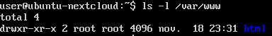
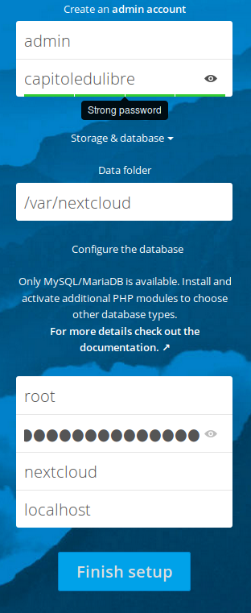

# Installation

Pour cela, on va suivre l'install par 

<https://nextcloud.com/install/>

<https://nextcloud.com/install/#instructions-server>

## Téléchargement de nextcloud depuis la VM

    curl https://download.nextcloud.com/server/installer/setup-nextcloud.php > setup-nextcloud.php
    sudo cp setup-nextcloud.php /var/www/html
    
On utilise ici `sudo` qui nous permet de copier le fichier dans `/var/www/html`
en tant que superutilisateur.

En effet, le répertoire `/var/www/html` a été créé par l'utilisateur `root` 
et ne peut pas être écrit directement par un utilisateur 'lambda', 
`user` dans notre cas.

## Procédure d'installation

Nous pouvons maintenant accéder à l'URL d'installation, dans mon cas ce sera :

http://192.168.1.18/setup-nextcloud.php

Il nous manque quelques dépendances PHP... rien de grave ! 

Installons les !

    sudo apt-get install php-xml php-curl php-zip php-mbstring php-gd

Puis redémarrons le serveur pour que 
les extensions installées soient prises en considération...

    sudo service apache2 restart
    
Nous rencontrons un problème de droit utilisateur...

Pour corriger ce problème, 
nous devons comprendre que le serveur HTTP Apache ne dispose pas 
de droits suffisants pour écrire dans son répertoire `/var/www/html`.

Le serveur HTTP Apache utilise l'utilisateur `www-data` 
pour écrire dans le répertoire `/var/www/html` .

Si nous regardons à qui appartient ce répertoire

    ls -l /var/www
    

Il appartient à `root`, le super utilisateur de la VM.

Nous allons réattribuer ce répertoire de travail à l'utilisateur `www-data` :

    sudo chown -R www-data /var/www/html
    
Puis, nous pouvons rafraîchir la page :

Dans notre cas, on choisi de l'installer dans le répertoire courant.

Il pourrait être utile de le mettre dans un sous répertoire néanmoins.

Et voilà !

Nous avons terminé l'installation de Nextcloud !

C'était pas si dur si ?

Prenons le temps de découvrir l'outil...