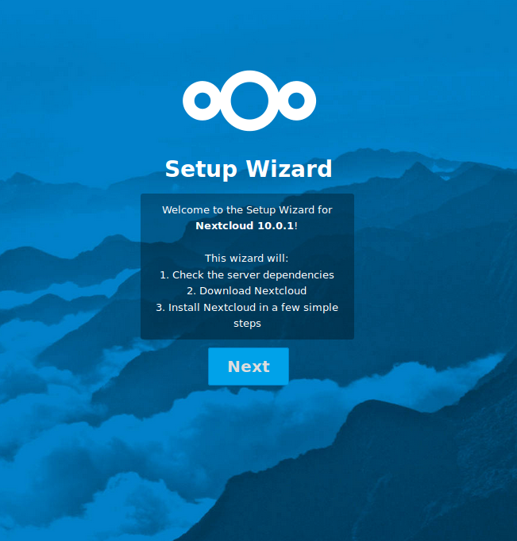
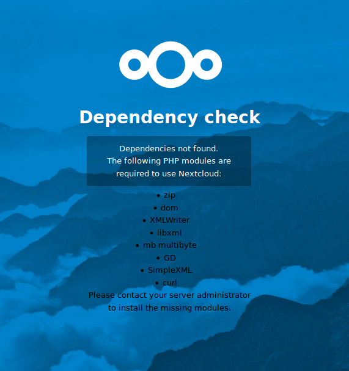
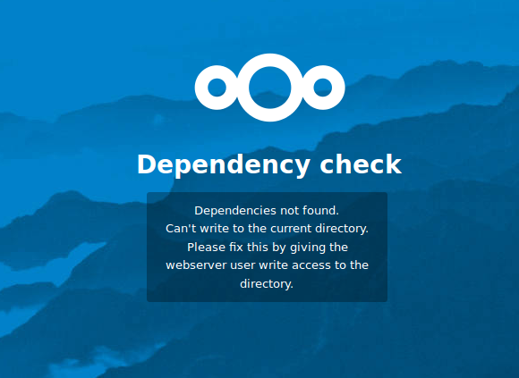
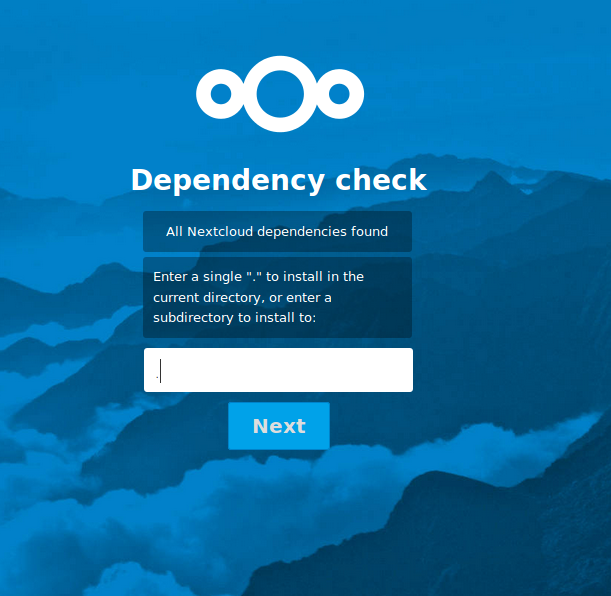
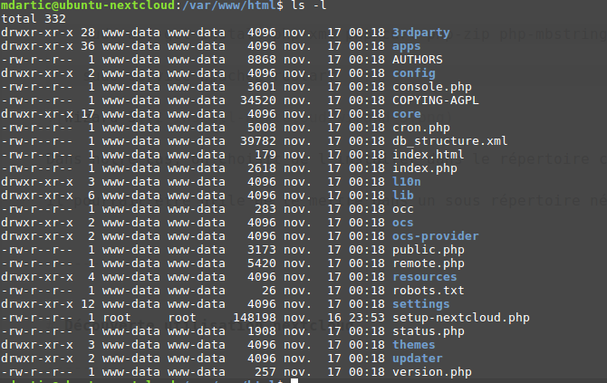
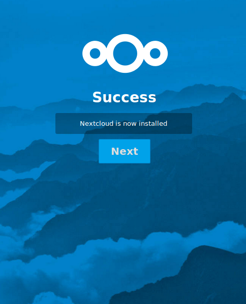
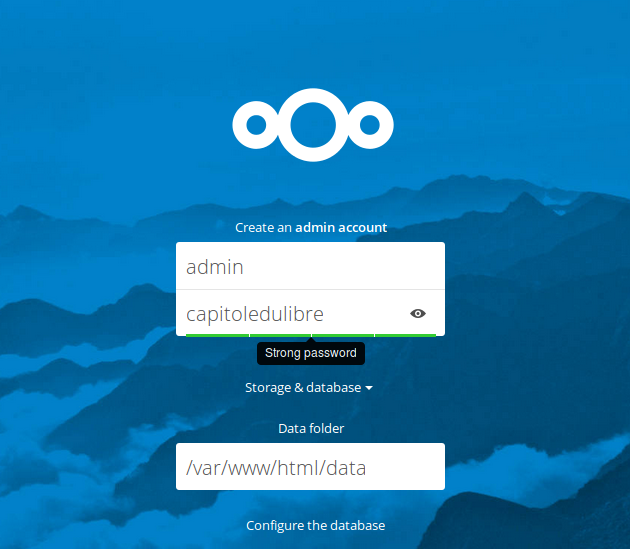
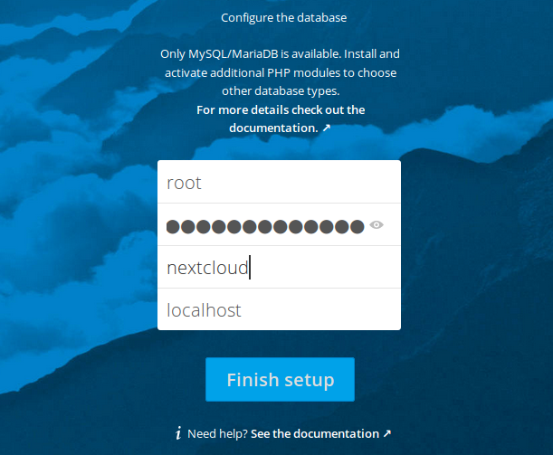
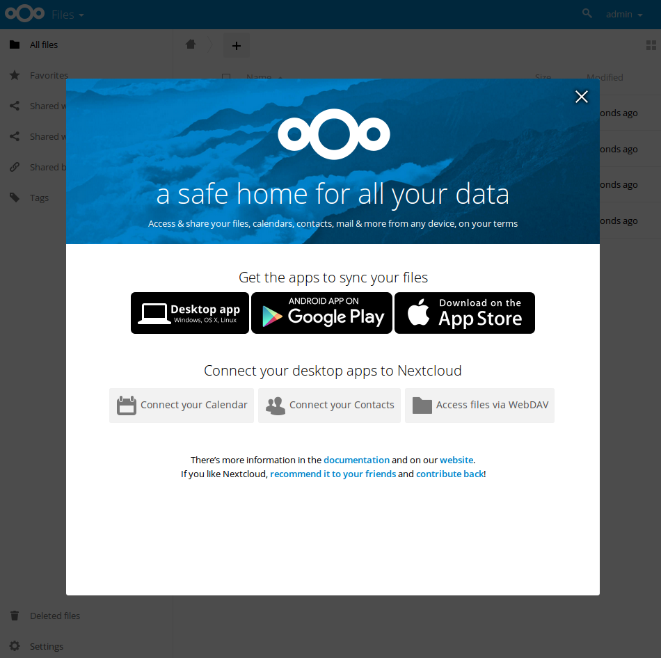

# Installation

Pour cela, on va suivre l'install par 

<https://nextcloud.com/install/>

<https://nextcloud.com/install/#instructions-server>

## Téléchargement de nextcloud depuis la VM

    curl https://download.nextcloud.com/server/installer/setup-nextcloud.php > setup-nextcloud.php
    sudo cp setup-nextcloud.php /var/www/html
    
On utilise ici `sudo` qui nous permet de copier le fichier dans `/var/www/html`
en tant que superutilisateur.

En effet, le répertoire `/var/www/html` a été créé par l'utilisateur `root` 
et ne peut pas être écrit directement par un utilisateur 'lambda'.

## Procédure d'installation

Nous pouvons maintenant accéder à l'URL d'installation, dans mon cas ce sera :

http://192.168.1.18/setup-nextcloud.php

    sudo apt-get install php-xml php-curl php-zip php-mbstring php-gd

    sudo service apache2 restart
    
Nous rencontrons un problème de droit utilisateur...

Dans notre cas, on choisit de l'installer dans le répertoire courant.

Il pourrait être utile de le mettre dans un sous répertoire néanmoins.

## La configuration avancée

via le config.php,

Par exemple, on peut changer l'application par défaut : mail

