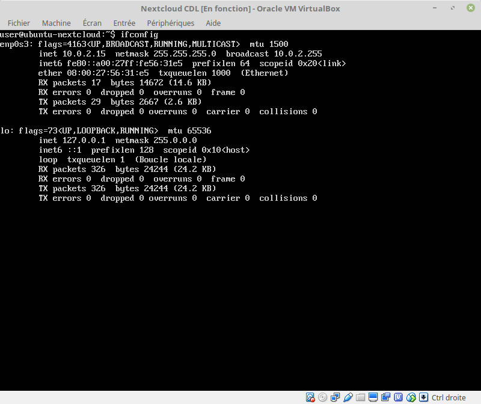
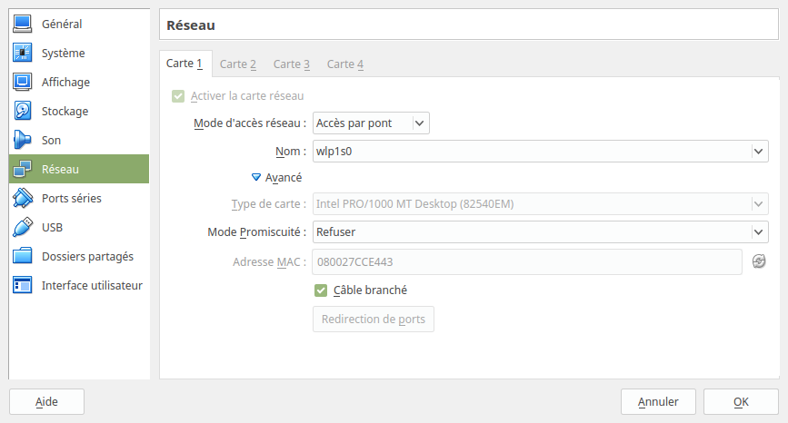

# Configuration de la VM

## Mise en état de marche de la VM

On ne peut pas encore accéder à la VM depuis notre navigateur.

Si on fait un `ifconfig` en ligne de commande sur la VM, 

que l'on prend l'IP en 10.0.2.15, 
et qu'on la rentre sur un navigateur en http://10.0.2.15, aucune réponse.

Idem pour le ping.

Nous devons configurer l'accès réseau de la VM en `Accès par pont`.

<http://askubuntu.com/questions/237461/how-do-i-access-ubuntu-server-running-in-virtualbox-from-outside#237467>

Puis redémarrer la VM pour que la machine prenne bien en considération 
les modifications sur la carte réseau.

## Sécurisation du serveur Apache

https://certbot.eff.org/

## Augmentation de la taille d'upload

