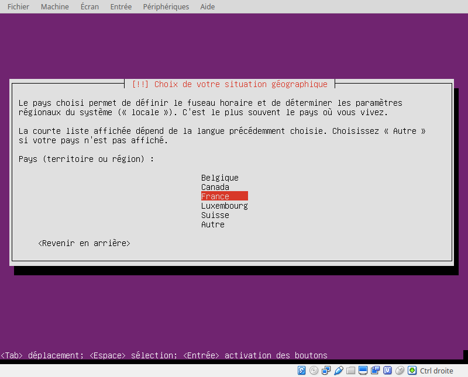
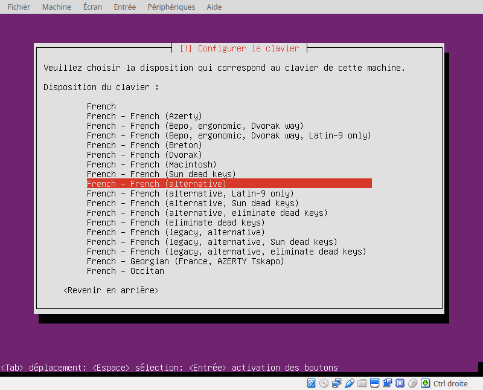

# Installation d'un serveur Ubuntu

Nous allons procéder à l'installation d'une machine virtuelle
sur Ubuntu Server.

Des clés sont à disposition 
pour te permettre de bypasser cette phase d'installation,
toujours un peu longuette.

Néanmoins, voici comment j'ai procédé pour te fournir la VM Ubuntu Server.

On va télécharger la version serveur, accessible ici :

<https://www.ubuntu.com/server>

L'idée de partir sur une version serveur est d'avoir une machine plus légère
qu'une machine intégrant les processus d'affichage graphique.

Les pages suivantes détaillent les différentes étapes 
pour aboutir à l'installation d'un serveur ubuntu,
préconfiguré pour accueillir une installation de la solution Nextcloud.

## Langage / Composants / Réseau

-----------

## Utilisateurs / Horloge

-----------

## Partitionnement des disques

## Pour terminer l'installation

Installation de openssh-server

    sudo apt-get install openssh-server
    sudo service ssh start

