# Installation de Ubuntu Server

## Téléchargement
On va télécharger la version serveur, accessible ici :

<https://www.ubuntu.com/server>

L'idée de partir sur une version serveur est d'avoir une machine plus légère
qu'une machine intégrant les processus d'affichage graphique.

Les pages suivantes détaillent les différentes étapes 
pour aboutir à l'installation d'un serveur ubuntu,
préconfiguré pour accueillir une installation de la solution Nextcloud.

## Langage / Composants / Réseau

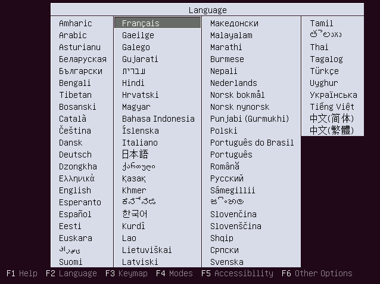
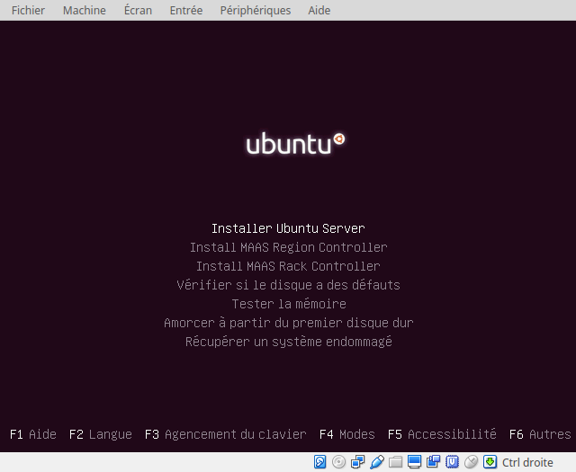
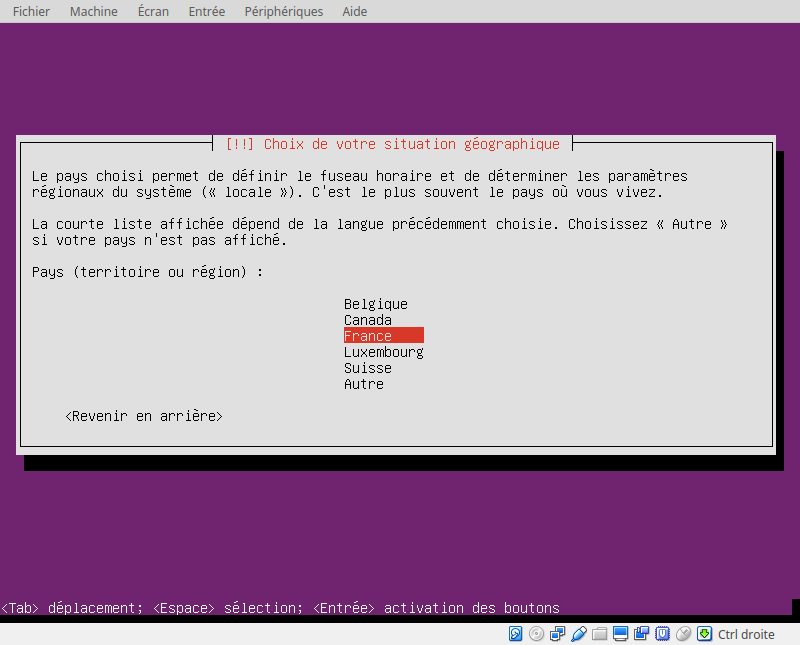

-----------

## Utilisateurs / Horloge

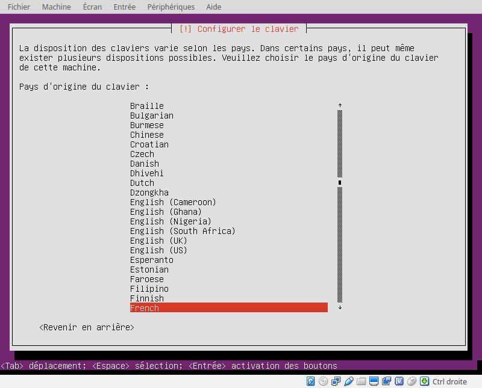
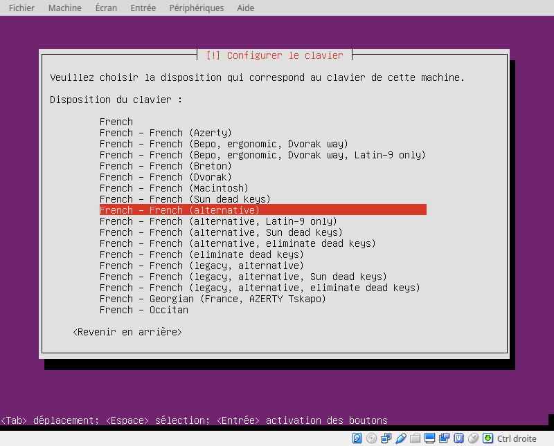
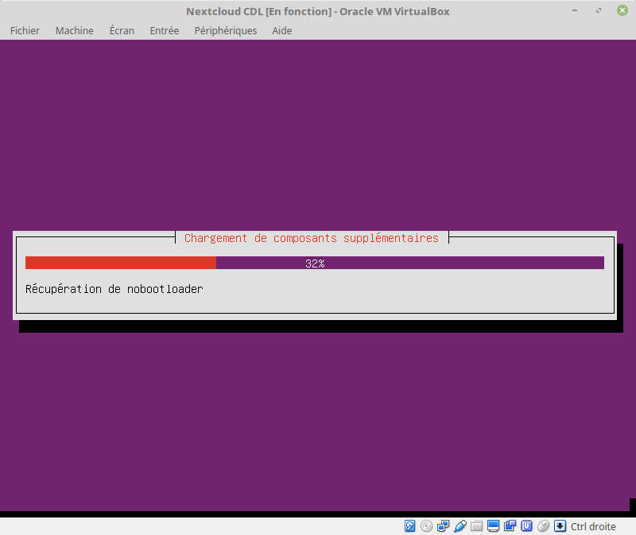

-----------

## Partitionnement des disques

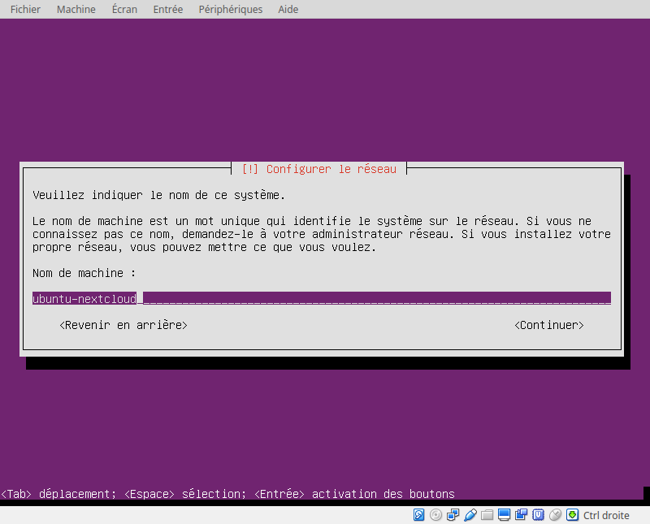
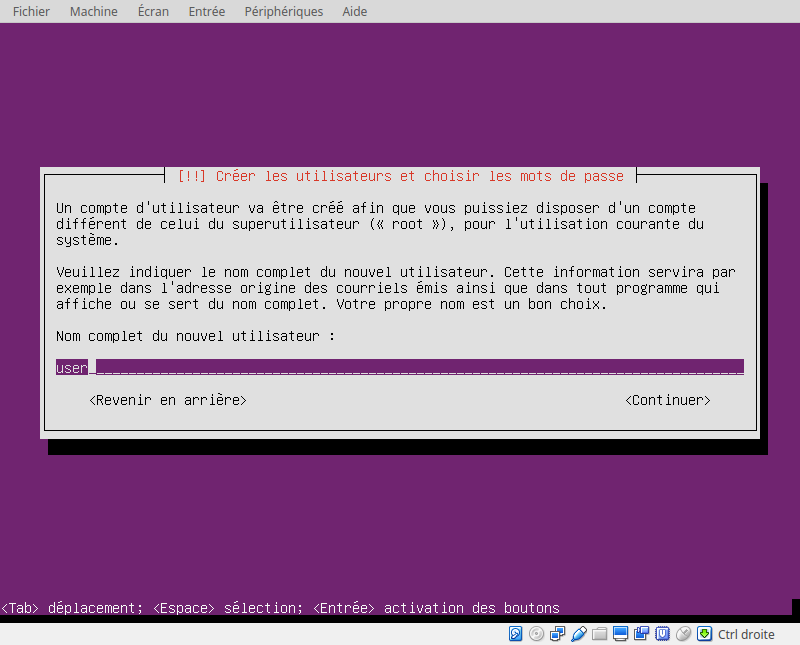
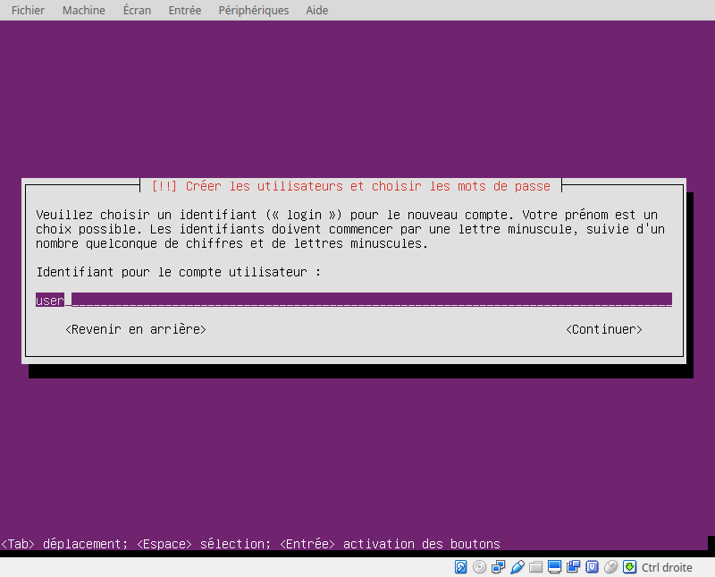
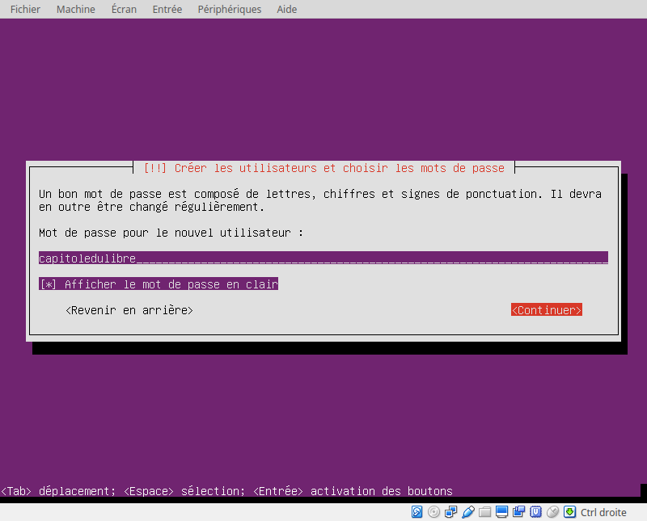

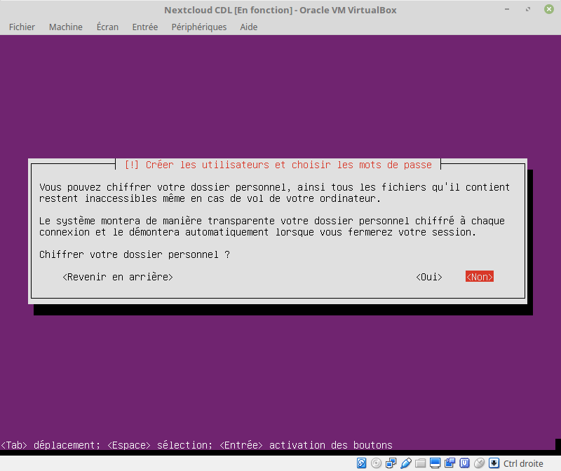
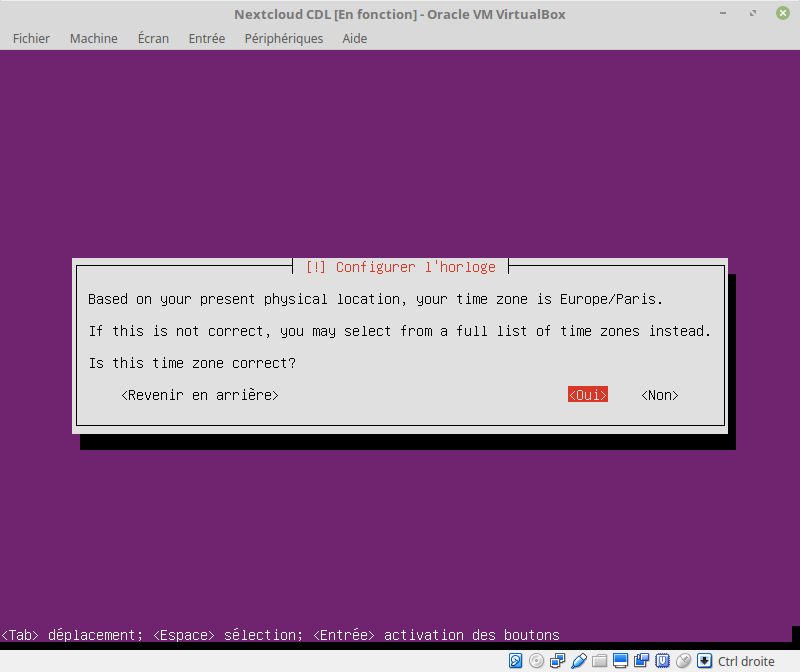
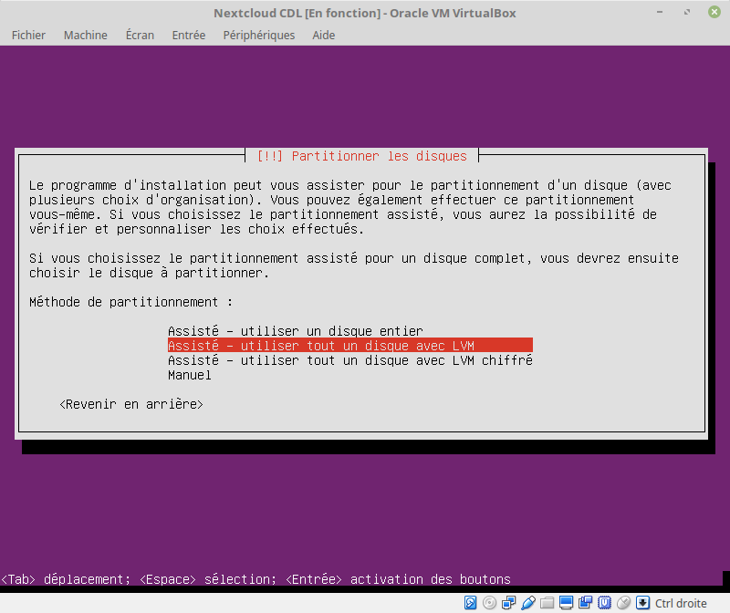

## Pour terminer l'installation

Installation de openssh-server

    sudo apt-get install openssh-server
    sudo service ssh start

