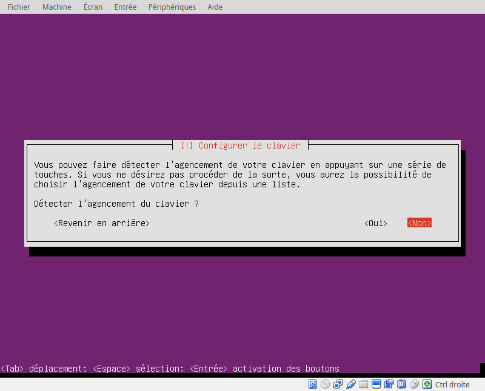

# Installation de Ubuntu Server

## Téléchargement

## Langage / Composants / Réseau

-----------

## Utilisateurs / Horloge

-----------

## Partitionnement des disques

## Pour terminer l'installation

Installation de openssh-server

    sudo apt-get install openssh-server
    sudo service ssh start

