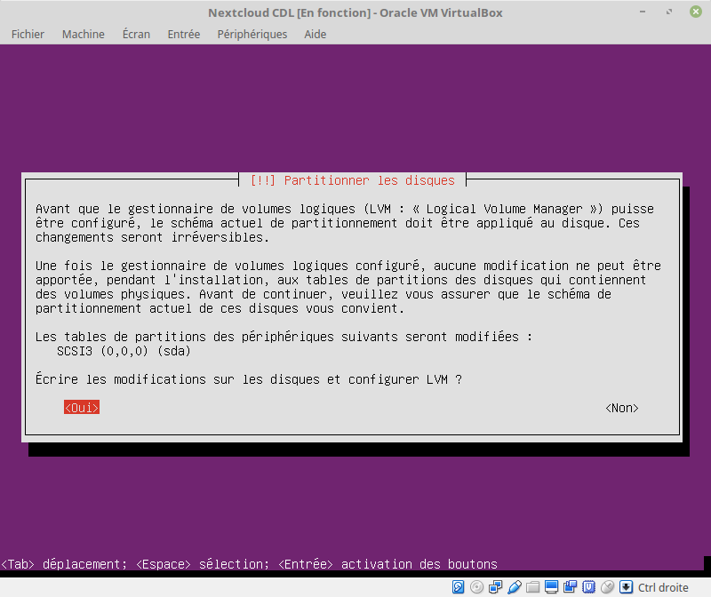

# Installation de Ubuntu Server

On va télécharger la version serveur, accessible ici :

https://www.ubuntu.com/server

L'idée de partir sur une version serveur est d'avoir une machine plus légère
qu'une machine intégrant les processus d'affichage graphique.

Les pages suivantes détaillent les différentes étapes 
pour aboutir à l'installation d'un serveur ubuntu,
préconfiguré pour accueillir une installation de la solution Nextcloud.

Voici les paramètres principaux :
- nom de la VM : `ubuntu-nextcloud`
- compte utilisateur : `user`
- mot de passe : `capitoledulibre`
- pas de chiffrement du dossier personnel
- installation automatique des mises à jour de sécurité
- paquets à installer : LAMP, mail server, open ssh, standard utilities
- mot de passe mysql : `capitoledulibre`
- configuration type messagerie : Site Internet
- nom de courrier : `ubuntu-nextcloud`

