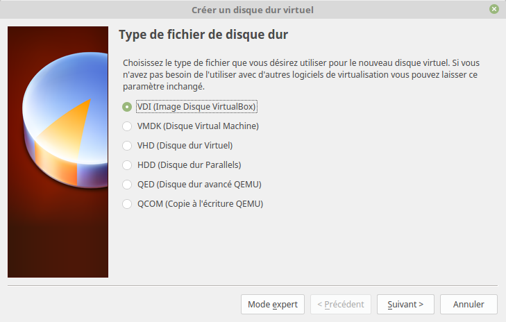

# Installation de Virtual Box

Direction https://www.virtualbox.org/wiki/Downloads

Tu y trouveras toute les ressources pour installer Virtual Box.

Attention, pensez à bien choisir votre paquet pour votre distrib Linux !

Voici les étapes à réaliser pour construire la VM 

